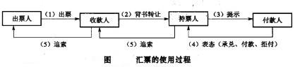

# Billing

## Glossary

- roles

  role | var | description
  -----|-----|------------
  出票人 | drawer | 签发汇票的人
  受票人 | drawee | 汇票的付款人
  承兑人 | acceptor | 远期汇票付款人办理了承兑手续，即成为了承兑人。在实际业务中，承兑人通常是开证申请人、开证行或其指定的付款银行
  收款人 | payee | 汇票规定的可收取票款的人，也称抬头人
  保证人 | guarantor | 对汇票的部分或全部金额保证付款的人
  背书人 | endorser | 收款人或持票人在汇票背面签字，将收款权力转让他人的人
  被转让人 | endorsee | 被背书人
  持票人 | holder | 持有汇票、有权收款的人，是汇票的合法持有者
  被追索人 | debtor | 被迫索人应为背书人、出票人、承兑人、保证人等票据债务人
  出质人 | pledgor | 将质物交给质权人，供作该债权担保的人
  质权人 | pledgee | 占有质物的债权人。质权人应当返还质物，债务人到期不清偿债务的，质权人有权就该质物的变价(协议折价或依法拍卖、变卖)价款优先受清偿

- actions

  action | var | description
  -------|-----|------------
  出票 | issue | 出票人签发汇票并交付给收款人的行为。出票后，出票人即承担汇票承兑和付款的责任，商业承兑汇票的出票人和承兑人可以相同。参考银行承兑汇票，出票人和收票人不得相同。
  承兑 | acceptance | 远期汇票的付款人在汇票上签名确认，承诺于汇票到期时付款的行为。承兑包含两个动作。第一个动作是付款人在汇票正面写明“承兑(Accepted)”字样并签字，注明承兑日期(写明汇票的到期日)。第二个动作是指将承兑的汇票交还持票人
  提示 | presentation | 收款人或持票人将汇票提交给付款人要求承兑或付款的行为，提示包括付款提示和承兑提示
  背书 | endorsement | 汇票的收款人或持票人在票据的背面记载有关的事项并签字。背书是把票据的权力转让给他人的行为，是记名汇票转让时的必要手续。背书包含两个动作，第一是在汇票背面背书，第二是把汇票交给被背书人
  付款 | payment | 即期汇票的受票人和远期汇票的承兑人在接到付款提示时，向提示汇票的合法持票人足额付款
  拒付 | dishonor | 在汇票提示付款和提示承兑时，付款人拒绝付款或拒绝承兑的行为
  追索 | recourse | 汇票遭到拒付后，持票人有追索权，即有权向其前手(背书人、出票人)要求偿付汇票金额、利息和其他费用的权利
  保证 | guaranty | 汇票责任当事人以外的第三者对汇票的部分或全部金额保证付款
  贴现 | discount | 银行承兑汇票的持票人在汇票到期日前，为了取得资金，贴付一定利息将票据权利转让给银行的票据行为
  质押 | pledge | 持票人为了给债权提供担保，在票据到期日前在电子商业汇票系统中进行登记，以该票据为债权人设立质权的票据行为
  
- other

  state/concept | var | descrption
  --------------|-----|------------
  可转让 | transferable | 规定票据是否可转让
  票据到期日 | due date |

> reference: http://wiki.mbalib.com/wiki/%E6%B1%87%E7%A5%A8

## Chaincode & REST API

chaincode | arguments | REST | description
----------|-----------|------|------------
checkdue | | N/A | check if there is a due bill
delete | {key} | N/A | delete an entity
query | {key} | N/A | get shim state information
register | {entity, account balance} | N/A | register a new user
getuserid | {entity} | N/A | return id for user name
billregister | {entity, due date, price, payer, payee, transferable} | POST `/bill` | register a bill
promptacceptance | {entity, bill number, action} | POST/PUT `/bill/acceptance` | prompt for acceptance
queryacceptance | {entity} | N/A | query acceptance status
promptwarrant | {entity, bill number, warrantor, action:1,0} | POST/PUT `/bill/warrant` | prompt for warrant
querywarrant | {entity} | N/A | query warrant information 
promptrevoke | {entity, bill number} | POST/PUT `/bill/revocation` | prompt for revocation
queryrevoke | {entity} | N/A | query revocation status
promptreceive | {entity, bill number, action:-1,0,1} | POST/PUT `/bill/reception` | prompt for reception
queryreceive | {entity} | N/A | query reception information
promptendorsement | {entity, bill number, endorsee, action:-1,0,1} | POST/PUT `/bill/endorsement` | prompt for endorsement
queryendorsement | {entity} | N/A | query endorsement status
promptpledge | {entity, bill number, pledgee, action:0,1} | POST/PUT `/bill/pledge` | prompt for pledge
querypledge | {entity} | N/A | query pledge information
promptpledgerelease | {entity, bill number, action:0,1} | POST/PUT `/bill/pledge/release` | prompt for pledge release
querypledgerelease | {entity} | N/A | query pledge status
promptdiscount | {entity, bill number, bank, action:0,1, type, insterest, amount} | POST/PUT `/bill/discount` | prompt for discount
querydiscount | {entity} | N/A | query discount information
promptpayment | {entity, bill number, action:-1,0,1} | POST/PUT `/bill/payment` | prompt for payment
querypayment | {entity} | N/A | query payment status
promptrecourse | {entity, bill number, borrower, action: 0} | POST/PUT `/bill/recourse` | prompt for recourse
queryrecourse | {entity} | N/A | query for recourse information

